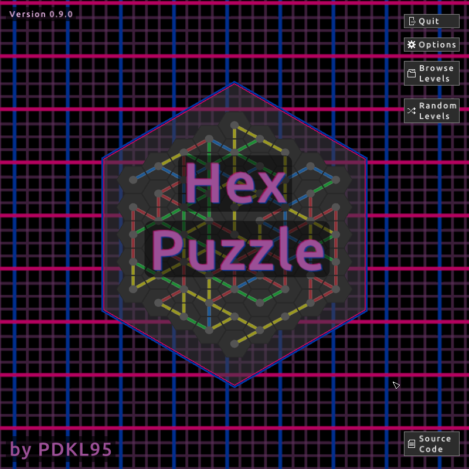
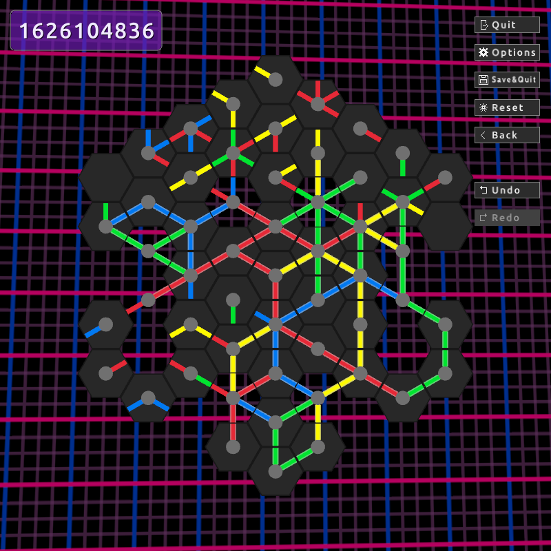
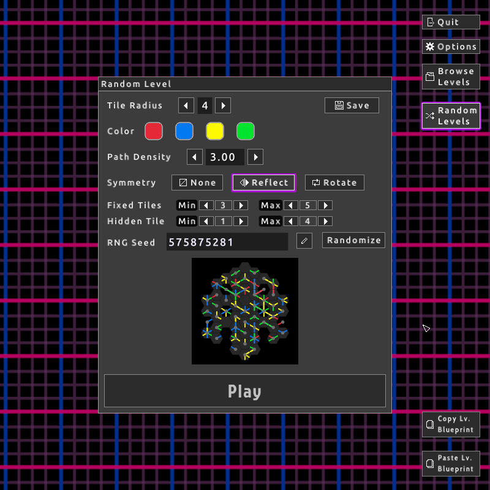

# HexPuzzle

A simple hex-tile puzzle game based on an old [flash game][fg].

[fg]: https://www.kongregate.com/games/Moonkey/hexiom-connect

* GitHub: <https://github.com/pdkl95/hexpuzzle>

## Screenshots
#### Title Screen



#### A Partially Solved Puzzle



#### The Random Level Generator



## Building & Installing

### Dependencies

* A working C compiler (both gcc and clang have been tested).

* OpenGL 3.3

### Downloading the source

The [source code][source] and [pre-built Linux builds][release]
are available on github.

[source]:  https://github.com/pdkl95/hexpuzzle
[release]: https://github.com/pdkl95/hexpuzzle/releases

Download the project with git:

    git clone https://github.com/pdkl95/hexpuzzle.git

or download and unpack the [zip arhive][ziparch] provided by GitHub.

[ziparch]: https://github.com/pdkl95/hexpuzzle/archive/refs/heads/main.zip

Afterwords, move into the source directory.

    cd hexpuzzle

### Building

    ./configure
    make

See `./configure --help` for a list of build and install options.

### Installing (optional)

    make install

You can also run the program directly after building.

    ./hexpuzzle

Installing is not necessary; the program is built as a single
self-contained executable file that should be able to run from
anywhere.

## Options

```
$ ./hexpuzzle --help
Usage: hexpuzzle [OPTIONS] [<file>.hexlevel | <file>.hexlevelpack]

Hex Puzzle
----------

A hex-tile based puzzle game.

OPTIONS
  -c, --config-dir=DIRECTORY  Directory to save/load persistant data.
                              (default: ${XDG_CONFIG_HOME}/hexpuzzle/
                                which is usually ~/.config/hexpuzzle/)
  -C, --no-config             Skip loading of all config files ("Safe Mode")

  -E, --allow-edit-mode       Enable the edit button when browsing local files

  -v, --verbose               More logging output (including raylib)
                                Use -v/--verbose twice to also enable
                                verbose raylib log messages

  -V, --version               Show version information and exit
  -h, --help                  Show this help and exit

GRAPHICS OPTIONS
      --animate-bg            Enable background animation (default: on)
   --no-animate-bg            Disable background animation
      --animate-win           Enable animation on level win (default: on)
   --no-animate-win           Disable animation on level win
      --use-physics           Enable the physics engine (default: on)
   --no-use-physics           Disable the physucs engine
      --use-shader-effects    Enable shader postprocesing effects (default: on)
   --no-use-shader-effects    Disable shader postprocesing effects
      --use-solve-timer       Enable level solve time tracking (default: on)
   --no-use-solve-timer       Disable level solve time tracking
      --show-previews         Enable showing small level previews (default: on)
   --no-show-previews         Disable showing small level previews
      --show-tooltips         Enable popup tooltips on mouse-hover (default: on)
   --no-show-tooltips         Disable popup tooltips
      --log-finished-levels   Enable ssving a log of finished levels (default: on)
   --no-log-finished-levels   Disable saving a log of finished levels
      --compress-finished-levels  Enable compressing finished_levels.dat (default: on)
   --no-compress-finished-levels  Save finished_levels.dat as uncompressed JSON

  -W, --width=NUMBER          Window width (default: 800)
  -H, --height=NUMBER         Window height (default: 800)
  -F, --fps=NUMBER            Maximum FPS (default: 30)

  -w, --wait-events           Use GLFW's WaitEvents to let the program
                              sleep instead of polling for events
                              every frame. Less CPU usage, but might
                              not awaken immediately during resize events.

ACTIONS
  -p, --play <file>                Play the given .hexlevel
                                     or .hexlevelpack file
  -r, --random[=SEED]              Play a random level, optionally using
                                     a given RNG seed (see --seed)
  -e, --edit <file>                Edit the given .hexlevel
                                     or .hexlevelpack file
      --create-blank-level <NAME>  Create a new level file that is blank.
      --create-random-level <NAME> Create a new level file that is
                                     randomly generated puzzle 
  -P, --pack <dir>                 Packasge a directory of .hexlevel files
                                     into a .hexlevelpack
  -U, --unpack <file.hexlevelpack> Unpack a hexlevelpack file
                                     into a directory of .hexlevel
      --demo                       Show an auto-solving demo ("attract") mode.
                                     No user input accepted except SPACE to advance
                                     the demo and ESC/q to quit.
      --demo-win                   Same as --demo, but only show the win animations.

ACTION OPTIONS
      --force                   Allow files to be overwritten (dangerous!)
  -s, --seed <SEED_INT_OR_STR>    Set the RNG seed used for level creation.
                                  Integers are used directly as the seed;
                                  non-integer strings are hashed.
  -R, --level-radius=NUMBER     Tile radius of created levels.
                                  Min: 1, Max: 4, Default: 2
      --level-min-fixed=NUMBER  Minimum number of fixed tiles.  (default: 2)
      --level-max-fixed=NUMBER  Maximum number of fixed tiles.  (default: 4)
      --level-min-hidden=NUMBER Minimum number of hidden tiles. (default: 1)
      --level-max-hidden=NUMBER Maximum number of hidden tiles. (default: 4)
  -d, --path-densitys=NUMBER    Average density of paths/tile.  (default: 2.5)
```

## License

This program is free software: you can redistribute it and/or modify
it under the terms of the GNU General Public License as published by
the Free Software Foundation, either version 3 of the License, or
(at your option) any later version.

This program is distributed in the hope that it will be useful,
but WITHOUT ANY WARRANTY; without even the implied warranty of
MERCHANTABILITY or FITNESS FOR A PARTICULAR PURPOSE.  See the
GNU General Public License for more details.

You should have received a [copy](LICENSE) of the GNU General Public License
along with this program.  If not, see <https://www.gnu.org/licenses/>.
